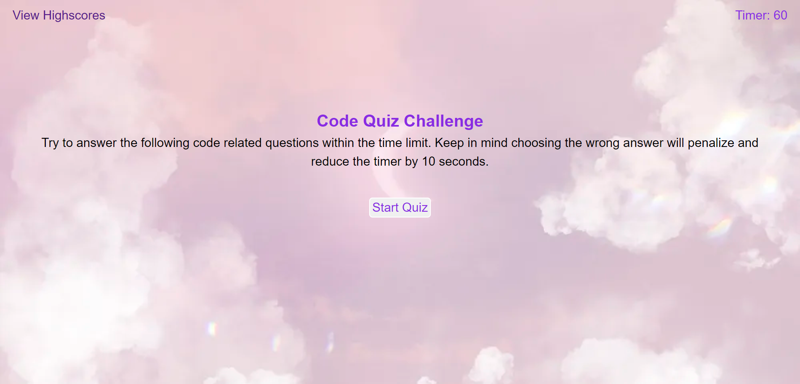
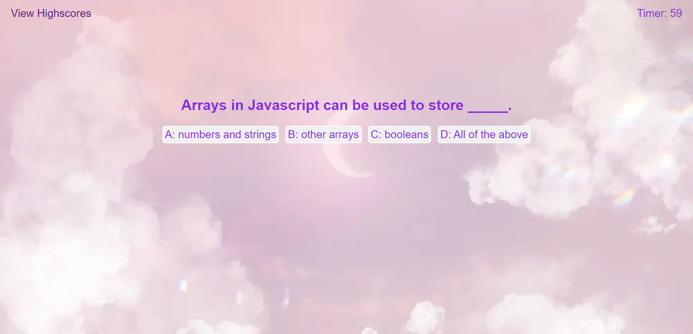
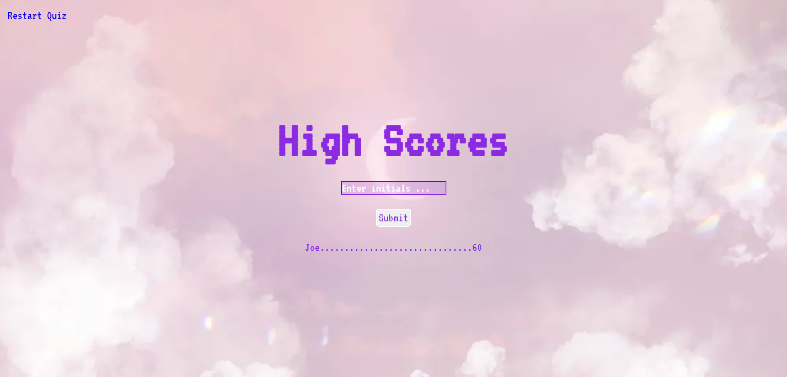

# Code-Quiz

 ## License

          
## Table of Content 
- [Project Description](#Description)
- [Usage](#Usage)
- [Contribution](#Contribution)
- [Installation](#Installation)
- [Tests](#Tests)
- [Questions](#Questions)
- [Email](#Email)
- [Github](#Github)
## Description
This app was created to test the user's knowledge on coding. It asks a series of questions that when answered correctly increases your final score. You can compare your score to previous attempts in order to see improvements in your coding development.

## Usage
- To use this app you first access the app. After you start the app you click "Start Quiz" and answer a series of questions before the timer runs out. 
- When the questions are complete, you enter your initials into the scoreboard to see the final score. 
- Click the "Restart Quiz" button in the top right corner if you wish to restart the quiz.

## Contributing
Tiffany Anglero

## Installation
User needs to click on live link: https://tanglero4.github.io/Code-Quiz/index.html

## Tests

## Questions 
Email: tiffanyanglero94@hotmail.com

GitHub: https://github.com/https://github.com/tanglero4?tab=repositories   
